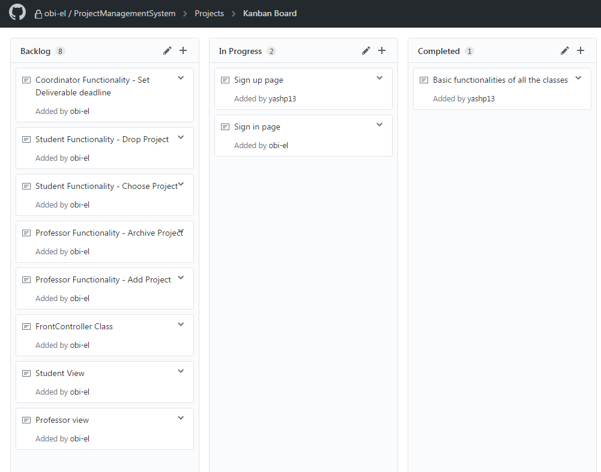

<html>

<head>
<meta http-equiv=Content-Type content="text/html; charset=windows-1252">
<meta name=Generator content="Microsoft Word 15 (filtered)">

</head>

<body lang=EN-US>

<b>4th Year Project Management System</b>

<b>&nbsp;</b>

A Web App
that manages Fourth year projects. It keeps track of students and their chosen
projects, professors and project coordinators. It manages the interactions
between them based on the system description below:

&nbsp;

“Profs can enter 4th year project topics, delete ones they no
longer offer, or archive them for later use. For a given 4th year project
topic, they can enter a description, program restrictions, and the number of
students required. Students can look up projects and apply for one that they
like. When a project is full, no more students can apply for it. The 4th year
project coordinator can search for students without a project and send them a
reminder. For the oral presentations, profs and students enter their
availability. The 4th year project coordinator can allocate the oral
presentations to rooms based on availability. This can be done manually or
using a very simple “best effort” algorithm. For the final project, students
submit their reports online by a deadline specified by the 4th year project
coordinator and enforced by the system.”

&nbsp;

Project Members:

Obinna Elobi

Yash Patel

Mathieu LeBlanc

Jiang Zening

&nbsp;

Milestone 1:

Obinna Elobi
- Set up Travis and Heroku with our repo

Yash Patel -
Wrote System Models.

Mathieu
LeBlanc - implemented sign up and sign in use cases with Mathieu

Zening Jiang
- Made maven Project, implemented sign up use case

&nbsp;

Backlog:

</body>

</html>
